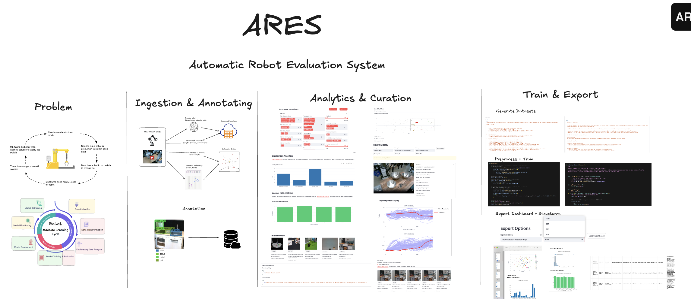

# ARES: Automatic Robot Evaluation System

 

ARES is a open-source system for automatically evaluating robot data using machine learning to quickly and accurately understand performance, identify areas for improvement, and enable rapid prototyping of new robot behaviors. The goal of this system is to shorten iteration cycles by using machine learning to provide fast, accurate feedback on robot data. ARES is built to be simple and scalable, with a special focus on ease of use. All computation and model inference can be run through local resources or cloud APIs (model providers like OpenAI, Anthropic, Gemini, Modal, Replicate, etc.), requiring only a credit card for access - no complex cloud infrastructure or GPU setup needed. 

[Demo Video](https://example.com/demo) TODO!

[Blog Post](https://example.com/blog) TODO! 

[Arxiv Paper](https://arxiv.org/) TODO!

## Who and what is ARES for?

ARES is a platform for understanding robot data, targeted at robot developers and researchers. You can use ARES to: 
- Curate and annotate ground-truth teleoperation data
- Evaluate the performance of robot policy rollouts
- Analyze batches of robot data to improve policies

## Overview
- [Stack](#stack)
- [Installation](#installation)
- [Configuration](#configuration)
- [Ingestion](#ingestion)
- [Annotation](#annotation)
- [Curation](#curation)
- [Training](#training)
- [Acknowledgements](#acknowledgements)
- [Citation](#citation)


## Stack
ARES is built to be simple and scalable. As such, we select tools that are easy to setup locally but also smooth to scale to cloud-level resources.
- Databases: [MongoDB](https://www.mongodb.com/), [SQLAlchemy](https://www.sqlalchemy.org/), [FAISS](https://github.com/facebookresearch/faiss)
- Model Inference: [litellm](https://github.com/BerriAI/litellm), configured with your choice of model provider (OpenAI, Anthropic, Gemini, HuggingFace, etc.)
- Compute Orchestration: [Modal](https://modal.com/)
- Frontend: [Streamlit](https://streamlit.io/), [Plotly](https://plotly.com/python/)
- Development: [Docker](https://www.docker.com/), [Cursor](https://www.cursor.com/), [VSCode](https://code.visualstudio.com/), [Pydantic](https://docs.pydantic.dev/)

## Installation

## Configuration

## Ingestion

## Annotation

## Curation

## Training

## Evaluation

## Limitations

## Acknowledgements
This project was developed by [Jacob Phillips](jacobdphillips.com) as a part of the [Andreessen Horowitz American Dynamism Engineering Fellows](https://a16z.com/the-american-dynamism-engineering-fellows-program/) program. 


## Citation
If using the ARES platform in your work, please cite it to acknowledge the authors. Suggested format:

```bibtex
@software{ARES,
    title = {ARES: Automatic Robot Evaluation System},
    author = {Jacob Phillips},
    url = {https://github.com/jacobphillips99/ares/tree/main},
    version = {insert version number},
    date = {insert date of usage},
    year = {2025},
}
```

You can also cite the whitepaper:
TODO TODO TODO


